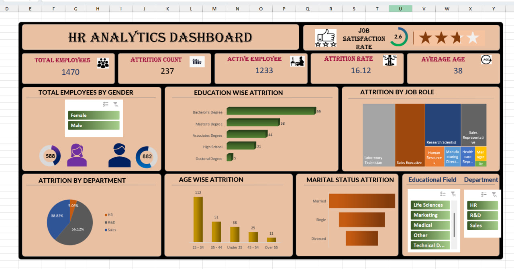

# 📊 HR Attrition Analysis

This project analyzes employee attrition data and builds an interactive dashboard using **Excel**.  
The dashboard provides insights into employee attrition patterns, demographics, and job satisfaction to help HR teams reduce employee turnover.  

---

## 📂 Project Files
- `HR ATTRITION REPORT PROJECT.xlsx` → Excel workbook with data and dashboard  
- `HRattrition.jpg` → Dashboard screenshot  

---

## 🚀 Key Insights
- **Total Employees**: 1470  
- **Attrition Count**: 237 employees (16.12% attrition rate)  
- **Active Employees**: 1233  
- **Average Age**: 38 years  
- **Job Satisfaction**: 2.6/5 average rating  

### 📌 Breakdown
- **Attrition by Gender**: More male employees compared to female  
- **Attrition by Education**: Highest attrition among Bachelor’s degree holders  
- **Attrition by Department**: R&D had the largest share of employees but also significant attrition  
- **Attrition by Age**: Employees aged 25–34 showed the highest attrition  
- **Attrition by Marital Status**: Single employees had higher attrition rates  
- **Attrition by Job Role**: Research Scientists and Sales Executives had notable attrition  

---

## 📸 Dashboard Screenshot

---

## 🛠 Tools Used
- **Microsoft Excel** → Data cleaning, pivot tables, and dashboard visualization  

---

## 📈 Key Learnings
- Learned how to use **Pivot Tables** and **Charts** for HR analytics  
- Applied **filters and slicers** for interactive dashboards  
- Gained insights into attrition patterns useful for HR decision-making  

---

## ✅ Future Scope
- Automate data import using **Power Query**  
- Connect with a live database (SQL / HRMS system)  
- Build advanced dashboards in **Power BI / Tableau** for deeper analysis  
